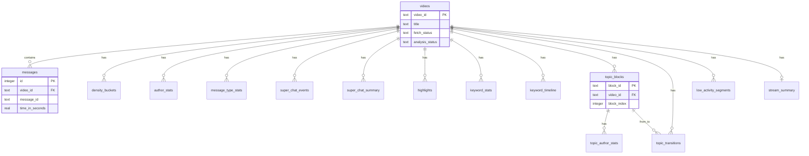

# LiveChatScope — DB スキーマ詳細

> タスク D-3 | ブランチ: `docs/db-schema`  
> 参照: [アーキテクチャ.md](アーキテクチャ.md), [API仕様.md](API仕様.md)

## 1. 概要

| 項目 | 決定 |
|------|------|
| RDBMS（第一弾） | **SQLite 3** |
| ファイル | `data/livechatscope.db`（`.gitignore`） |
| 文字コード | UTF-8 |
| PK 方針 | 内部 `INTEGER` + 自然キー（`video_id`, `message_id` 等） |
| 将来 | PostgreSQL へ移行（DDL は互換を意識） |
| 全文検索 | SQLite **FTS5**（`messages_fts`） |

### 1.1 設計方針

- **videos** を分析ジョブの中心エンティティとする
- **messages** は取得データの正（source of truth）
- 分析結果は **video_id 単位で DELETE → 再 INSERT**（冪等 Pipeline）
- **tokens** は中間データ。Stage 4 完了後に削除可
- **stream_summary** は UI サマリー用 denormalize（Stage 7）

---

## 2. ERD



---

## 3. テーブル ↔ Pipeline Stage 対応

| Stage | 名称 | 書き込みテーブル | 削除（再分析時） |
|:-----:|------|------------------|------------------|
| 0 | 正規化・インデックス | `videos`, `messages`, `messages_fts` | ✓ |
| 1 | 基本集計 | `density_buckets`, `author_stats`, `message_type_stats` | ✓ |
| 2 | 盛り上がり | `highlights` | ✓ |
| 3 | スパチャ | `super_chat_events`, `super_chat_summary`, `super_chat_buckets` | ✓ |
| 4 | キーワード | `tokens` → `keyword_stats`, `keyword_timeline` | ✓（tokens は Stage 後削除可） |
| 5 | 話題ブロック | `topic_blocks` | ✓ |
| 6a | 話題遷移 | `topic_transitions` | ✓ |
| 6b | 話題別ユーザ | `topic_author_stats` | ✓ |
| 6c | 低活動 | `low_activity_segments` | ✓ |
| 7 | サマリー | `stream_summary` | ✓ |

**再分析時の削除順**（FK 依存順）:

```
topic_author_stats → topic_transitions → topic_blocks
→ tokens, keyword_*, highlights, low_activity_*
→ density_*, author_stats, message_type_stats
→ super_chat_*, stream_summary
→ messages_fts → messages
→ videos（再 INSERT）
```

派生のみ再実行する場合は `video_id` 対象の派生テーブルのみ DELETE。

---

## 4. DDL（SQLite）

### 4.1 `videos`

分析対象動画・ジョブ状態。

```sql
CREATE TABLE videos (
    video_id            TEXT PRIMARY KEY,          -- YouTube 11 文字 ID
    source_url          TEXT NOT NULL,
    title               TEXT,
    channel_name        TEXT,
    channel_id          TEXT,
    duration_seconds    REAL,
    message_count       INTEGER NOT NULL DEFAULT 0,

    fetch_status        TEXT NOT NULL DEFAULT 'pending'
                        CHECK (fetch_status IN ('pending','fetching','fetched','failed')),
    analysis_status     TEXT NOT NULL DEFAULT 'pending'
                        CHECK (analysis_status IN ('pending','running','partial','complete','failed')),

    fetch_error_code    TEXT,
    fetch_error_message TEXT,
    analysis_error_code TEXT,
    analysis_error_message TEXT,

    analysis_stage      INTEGER,                   -- 0–8, running 時
    messages_fetched    INTEGER NOT NULL DEFAULT 0, -- 進捗用

    fetched_at          TEXT,                      -- ISO8601 UTC
    analyzed_at         TEXT,
    created_at          TEXT NOT NULL DEFAULT (datetime('now')),
    updated_at          TEXT NOT NULL DEFAULT (datetime('now'))
);

CREATE INDEX idx_videos_fetch_status ON videos(fetch_status);
CREATE INDEX idx_videos_analysis_status ON videos(analysis_status);
```

---

### 4.2 `messages`

チャットメッセージ正データ（Stage 0）。

```sql
CREATE TABLE messages (
    id                  INTEGER PRIMARY KEY AUTOINCREMENT,
    video_id            TEXT NOT NULL REFERENCES videos(video_id) ON DELETE CASCADE,
    message_id          TEXT NOT NULL,             -- YouTube 側 ID
    author_id           TEXT,
    author_name         TEXT,
    message_type        TEXT NOT NULL,             -- text_message, super_chat, ...
    text                TEXT,
    time_in_seconds     REAL,                      -- NULL 可（欠損時）
    timestamp_usec      INTEGER,                   -- UNIX マイクロ秒
    super_chat_amount   REAL,
    super_chat_currency TEXT,
    raw_json            TEXT,                      -- デバッグ用（任意・第一弾は省略可）

    created_at          TEXT NOT NULL DEFAULT (datetime('now')),

    UNIQUE (video_id, message_id)
);

CREATE INDEX idx_messages_video_time ON messages(video_id, time_in_seconds);
CREATE INDEX idx_messages_video_author ON messages(video_id, author_id);
CREATE INDEX idx_messages_video_type ON messages(video_id, message_type);
CREATE INDEX idx_messages_video_author_name ON messages(video_id, author_name);
```

**FTS5（全文検索・Stage 0）**

```sql
CREATE VIRTUAL TABLE messages_fts USING fts5(
    text,
    author_name,
    content='messages',
    content_rowid='id',
    tokenize='unicode61'
);

-- INSERT 後に messages_fts に同期（トリガー）
CREATE TRIGGER messages_fts_insert AFTER INSERT ON messages BEGIN
    INSERT INTO messages_fts(rowid, text, author_name)
    VALUES (new.id, new.text, new.author_name);
END;

CREATE TRIGGER messages_fts_delete AFTER DELETE ON messages BEGIN
    INSERT INTO messages_fts(messages_fts, rowid, text, author_name)
    VALUES ('delete', old.id, old.text, old.author_name);
END;

CREATE TRIGGER messages_fts_update AFTER UPDATE ON messages BEGIN
    INSERT INTO messages_fts(messages_fts, rowid, text, author_name)
    VALUES ('delete', old.id, old.text, old.author_name);
    INSERT INTO messages_fts(rowid, text, author_name)
    VALUES (new.id, new.text, new.author_name);
END;
```

---

### 4.3 `density_buckets`（Stage 1）

```sql
CREATE TABLE density_buckets (
    video_id            TEXT NOT NULL REFERENCES videos(video_id) ON DELETE CASCADE,
    bucket_start_sec    INTEGER NOT NULL,
    bucket_sec          INTEGER NOT NULL DEFAULT 60,
    count               INTEGER NOT NULL DEFAULT 0,
    PRIMARY KEY (video_id, bucket_start_sec)
);
```

---

### 4.4 `author_stats`（Stage 1）

```sql
CREATE TABLE author_stats (
    video_id            TEXT NOT NULL REFERENCES videos(video_id) ON DELETE CASCADE,
    author_id           TEXT NOT NULL,
    author_name         TEXT,
    message_count       INTEGER NOT NULL,
    rank                INTEGER NOT NULL,
    is_core_regular     INTEGER NOT NULL DEFAULT 0,  -- Stage 6b 後に更新可
    PRIMARY KEY (video_id, author_id)
);

CREATE INDEX idx_author_stats_rank ON author_stats(video_id, rank);
```

---

### 4.5 `message_type_stats`（Stage 1）

```sql
CREATE TABLE message_type_stats (
    video_id            TEXT NOT NULL REFERENCES videos(video_id) ON DELETE CASCADE,
    message_type        TEXT NOT NULL,
    count               INTEGER NOT NULL,
    PRIMARY KEY (video_id, message_type)
);
```

---

### 4.6 `super_chat_events`（Stage 3）

```sql
CREATE TABLE super_chat_events (
    id                  INTEGER PRIMARY KEY AUTOINCREMENT,
    video_id            TEXT NOT NULL REFERENCES videos(video_id) ON DELETE CASCADE,
    message_id          TEXT,                      -- messages と紐付け
    time_in_seconds     REAL NOT NULL,
    author_id           TEXT,
    author_name         TEXT,
    amount              REAL NOT NULL,
    currency            TEXT NOT NULL,
    text                TEXT,
    created_at          TEXT NOT NULL DEFAULT (datetime('now'))
);

CREATE INDEX idx_super_chat_video_time ON super_chat_events(video_id, time_in_seconds);
```

---

### 4.7 `super_chat_summary`（Stage 3）

```sql
CREATE TABLE super_chat_summary (
    video_id            TEXT NOT NULL REFERENCES videos(video_id) ON DELETE CASCADE,
    currency            TEXT NOT NULL,
    total_amount        REAL NOT NULL,
    count               INTEGER NOT NULL,
    PRIMARY KEY (video_id, currency)
);
```

---

### 4.8 `super_chat_buckets`（Stage 3）

密度重ねグラフ用（api-spec `/super-chats/summary` timeline）。

```sql
CREATE TABLE super_chat_buckets (
    video_id            TEXT NOT NULL REFERENCES videos(video_id) ON DELETE CASCADE,
    bucket_start_sec    INTEGER NOT NULL,
    bucket_sec          INTEGER NOT NULL DEFAULT 60,
    count               INTEGER NOT NULL DEFAULT 0,
    total_amount        REAL NOT NULL DEFAULT 0,
    currency            TEXT NOT NULL DEFAULT 'JPY',
    PRIMARY KEY (video_id, bucket_start_sec, currency)
);
```

---

### 4.9 `highlights`（Stage 2）

```sql
CREATE TABLE highlights (
    video_id            TEXT NOT NULL REFERENCES videos(video_id) ON DELETE CASCADE,
    rank                INTEGER NOT NULL,
    time_in_seconds     REAL NOT NULL,
    score               REAL NOT NULL,
    clip_start_sec      INTEGER NOT NULL,
    clip_end_sec        INTEGER NOT NULL,
    PRIMARY KEY (video_id, rank)
);

CREATE INDEX idx_highlights_time ON highlights(video_id, time_in_seconds);
```

---

### 4.10 `tokens`（Stage 4・中間）

Pipeline 完了後削除推奨。

```sql
CREATE TABLE tokens (
    id                  INTEGER PRIMARY KEY AUTOINCREMENT,
    video_id            TEXT NOT NULL REFERENCES videos(video_id) ON DELETE CASCADE,
    message_id          TEXT NOT NULL,
    time_in_seconds     REAL,
    bucket_start_sec    INTEGER,
    token               TEXT NOT NULL
);

CREATE INDEX idx_tokens_video_token ON tokens(video_id, token);
CREATE INDEX idx_tokens_video_bucket ON tokens(video_id, bucket_start_sec);
```

---

### 4.11 `keyword_stats`（Stage 4）

```sql
CREATE TABLE keyword_stats (
    video_id            TEXT NOT NULL REFERENCES videos(video_id) ON DELETE CASCADE,
    token               TEXT NOT NULL,
    count               INTEGER NOT NULL,
    rank                INTEGER NOT NULL,
    PRIMARY KEY (video_id, token)
);

CREATE INDEX idx_keyword_stats_rank ON keyword_stats(video_id, rank);
```

---

### 4.12 `keyword_timeline`（Stage 4）

```sql
CREATE TABLE keyword_timeline (
    video_id            TEXT NOT NULL REFERENCES videos(video_id) ON DELETE CASCADE,
    bucket_start_sec    INTEGER NOT NULL,
    token               TEXT NOT NULL,
    count               INTEGER NOT NULL,
    PRIMARY KEY (video_id, bucket_start_sec, token)
);
```

---

### 4.13 `topic_blocks`（Stage 5）

```sql
CREATE TABLE topic_blocks (
    block_id            TEXT PRIMARY KEY,          -- UUID
    video_id            TEXT NOT NULL REFERENCES videos(video_id) ON DELETE CASCADE,
    block_index         INTEGER NOT NULL,
    start_sec           REAL NOT NULL,
    end_sec             REAL NOT NULL,
    label               TEXT NOT NULL,           -- 推定ラベル
    message_count       INTEGER NOT NULL DEFAULT 0,
    unique_authors      INTEGER NOT NULL DEFAULT 0,
    super_chat_total    REAL NOT NULL DEFAULT 0,   -- 主通貨 or 合算方針は実装時
    super_chat_currency TEXT,
    UNIQUE (video_id, block_index)
);

CREATE INDEX idx_topic_blocks_video ON topic_blocks(video_id, block_index);
```

---

### 4.14 `topic_transitions`（Stage 6a）

```sql
CREATE TABLE topic_transitions (
    id                  INTEGER PRIMARY KEY AUTOINCREMENT,
    video_id            TEXT NOT NULL REFERENCES videos(video_id) ON DELETE CASCADE,
    from_block_id       TEXT NOT NULL REFERENCES topic_blocks(block_id) ON DELETE CASCADE,
    to_block_id         TEXT NOT NULL REFERENCES topic_blocks(block_id) ON DELETE CASCADE,
    from_block_index    INTEGER NOT NULL,
    to_block_index      INTEGER NOT NULL,
    from_label          TEXT,
    to_label            TEXT,
    at_sec              REAL NOT NULL
);

CREATE INDEX idx_topic_transitions_video ON topic_transitions(video_id);
```

---

### 4.15 `topic_author_stats`（Stage 6b）

```sql
CREATE TABLE topic_author_stats (
    block_id            TEXT NOT NULL REFERENCES topic_blocks(block_id) ON DELETE CASCADE,
    video_id            TEXT NOT NULL REFERENCES videos(video_id) ON DELETE CASCADE,
    author_id           TEXT NOT NULL,
    author_name         TEXT,
    message_count       INTEGER NOT NULL,
    rank                INTEGER NOT NULL,
    PRIMARY KEY (block_id, author_id)
);

CREATE INDEX idx_topic_author_stats_rank ON topic_author_stats(block_id, rank);
```

---

### 4.16 `low_activity_segments`（Stage 6c）

```sql
CREATE TABLE low_activity_segments (
    id                  INTEGER PRIMARY KEY AUTOINCREMENT,
    video_id            TEXT NOT NULL REFERENCES videos(video_id) ON DELETE CASCADE,
    start_sec           REAL NOT NULL,
    end_sec             REAL NOT NULL,
    duration_sec        REAL NOT NULL,
    avg_density         REAL NOT NULL
);

CREATE INDEX idx_low_activity_video ON low_activity_segments(video_id, start_sec);
```

---

### 4.17 `stream_summary`（Stage 7）

```sql
CREATE TABLE stream_summary (
    video_id            TEXT PRIMARY KEY REFERENCES videos(video_id) ON DELETE CASCADE,
    summary_json        TEXT NOT NULL,             -- api-spec GET /summary 互換 JSON
    generated_at        TEXT NOT NULL DEFAULT (datetime('now'))
);
```

---

### 4.18 `analysis_params`（任意・第一弾）

動画ごとに使用した分析パラメータを記録（再現性・デバッグ用）。

```sql
CREATE TABLE analysis_params (
    video_id            TEXT PRIMARY KEY REFERENCES videos(video_id) ON DELETE CASCADE,
    params_json         TEXT NOT NULL,             -- 分析パラメータ.md 既定値スナップショット
    created_at          TEXT NOT NULL DEFAULT (datetime('now'))
);
```

---

## 5. 初期化スクリプト

リポジトリ配置案: `backend/db/schema.sql`

```bash
mkdir -p data
sqlite3 data/livechatscope.db < backend/db/schema.sql
```

FastAPI 起動時に `schema.sql` を実行するマイグレーション（第一弾 POC）は **idempotent**（`CREATE TABLE IF NOT EXISTS`）推奨。

---

## 6. 主要クエリパターン（API 対応）

| API | クエリ |
|-----|--------|
| GET `/summary` | `SELECT summary_json FROM stream_summary WHERE video_id = ?` |
| GET `/density` | `SELECT * FROM density_buckets WHERE video_id = ? ORDER BY bucket_start_sec` |
| GET `/highlights` | `SELECT * FROM highlights WHERE video_id = ? ORDER BY rank LIMIT ?` |
| GET `/topics` | `SELECT * FROM topic_blocks WHERE video_id = ? ORDER BY block_index` |
| GET `/messages?q=` | `SELECT m.* FROM messages m JOIN messages_fts f ON m.id = f.rowid WHERE messages_fts MATCH ? AND m.video_id = ?` |
| GET `/authors` | `SELECT * FROM author_stats WHERE video_id = ? ORDER BY rank LIMIT ?` |
| GET `/authors/by-topic/{block_id}` | `SELECT * FROM topic_author_stats WHERE block_id = ? ORDER BY rank` |

`jump_url` は **DB 保存せず API 層で生成**（第一弾方針。必要なら VIEW 化可）。

---

## 7. 容量見積もり（10 万メッセージ）

| テーブル | 行数目安 | 備考 |
|----------|----------|------|
| messages | 100,000 | 主容量 |
| tokens | 500,000+ | **削除推奨** |
| density_buckets | ~120（60秒バケット×2h） | 小 |
| keyword_timeline | 数万 | 中 |
| その他派生 | 小〜中 | |

第一弾 POC: **単一 video ずつ分析** なら SQLite で十分。

---

## 8. PostgreSQL 移行メモ（将来）

| SQLite | PostgreSQL |
|--------|------------|
| `TEXT` datetime | `TIMESTAMPTZ` |
| FTS5 | `tsvector` + GIN index |
| `INTEGER` boolean | `BOOLEAN` |
| `AUTOINCREMENT` | `SERIAL` / `GENERATED` |
| FK `ON DELETE CASCADE` | 同様 |

---

## 9. 完了条件（D-3）

- [x] DDL（SQLite）全テーブル
- [x] インデックス・FTS5・トリガー
- [x] ERD（Mermaid）
- [x] Pipeline Stage 対応表・再分析削除順
- [x] API クエリパターン対応
- [x] 初期化スクリプト方針
