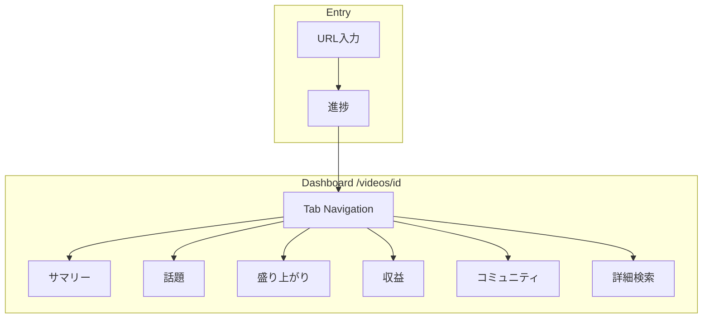

# LiveChatScope — 画面仕様 / UI 設計

> 参照: [概要.md](概要.md), [アーキテクチャ.md](アーキテクチャ.md)

## 1. 概要

### 1.1 目的

個人配信者が配信終了後に **URL 入力 → 分析結果の俯瞰 → 任意時刻へジャンプ** までを、  
迷わず操作できる Web UI の仕様を定義する。

### 1.2 第一弾の UI 方針

| 項目 | 方針 |
|------|------|
| 完成度 | **動くプロトタイプ優先**。見た目はモダン基盤でスタートし、後から整える |
| 判断 | 迷ったら **要素を盛る**（後で削る） |
| 言語 | **日本語のみ**（i18n は第一弾完成後） |
| デバイス | **PC ブラウザ主**（1280px 以上を主設計幅） |
| スマホ | **優先度低**。分析結果の **閲覧のみ** 破綻しない程度でよい |
| プレイヤー | 埋め込みなし。ジャンプは **YouTube 新規タブ** |

### 1.3 ユーザーフロー（確定）

```
[トップ: URL 入力]
        │
        ▼ 解析開始
[進捗画面: 取得 → 分析]
        │
        ▼ 完了
[ダッシュボード: タブ UI]
   サマリー │ 話題 │ 盛り上がり │ 収益 │ コミュニティ │ 詳細検索
```

---

## 2. UI スタック（推奨）

第一弾で **モダン UI** と **開発コスト** のバランスが最も良い構成。

### 2.1 第一推奨: shadcn/ui + Tailwind CSS + Recharts

| 要素 | 選定 | 理由 |
|------|------|------|
| コンポーネント | **shadcn/ui** | Next.js App Router と相性◎。コピー型で依存が軽い |
| スタイル | **Tailwind CSS** | shadcn 標準。デザイントークン調整が容易 |
| グラフ | **Recharts** | architecture 案と一致。密度・重ねグラフ向き |
| アイコン | **lucide-react** | shadcn 標準 |

**難易度**: 低〜中。Next.js プロジェクト作成 + `shadcn init` で即着手可能。  
**見た目**: SaaS 系ダッシュボードとして十分モダン。

### 2.2 代替案（参考）

| 候補 | 長所 | 短所 | 第一弾向き |
|------|------|------|:----------:|
| **MUI (Material UI)** | コンポーネント豊富 | バンドル重・カスタムが重い | △ |
| **Chakra UI** | 導入簡単 | 近年のモダン SaaS 感は shadcn より弱い | △ |
| **Mantine** | 機能多い | 学習コスト・デザイン統一に手間 | △ |
| **素の Tailwind のみ** | 最軽量 | 最初から UI 作り込みで工数増 | △ |

**決定（第一弾）**: **shadcn/ui + Tailwind + Recharts** で進める。

### 2.3 デザイントークン（仮）

| トークン | 値（仮） | 備考 |
|----------|----------|------|
| カラーモード | **ダーク優先** + ライト切替（後回し可） | 配信者の夜間利用を想定 |
| Primary | 青系（YouTube に寄せすぎない `#3b82f6` 付近） | 後で調整 |
| 背景 | `slate-950` / `slate-900` | ダーク基調 |
| カード | `rounded-lg` + 薄ボーダー | shadcn Card 標準 |
| フォント | `Inter` + **`Noto Sans JP`** | 日本語可読性 |
| 最大幅 | `max-w-7xl`（1280px） | ダッシュボード本体 |

### 2.4 レスポンシブ方針

| 幅 | 優先度 | 方針 |
|----|:------:|------|
| ≥1280px | ★★★ | 主設計。全タブ・グラフ・表をフル表示 |
| 768–1279px | ★★ | タブは横スクロール or 折りたたみ。グラフは縮小 |
| <768px | ★ | **閲覧のみ**: サマリー数値・リスト・ジャンプリンクが読めること。グラフ簡略化可 |

第一弾では **768px 未満の専用レイアウトは作らない**（単一カラムに自然落ちする程度）。

---

## 3. 情報アーキテクチャ

### 3.1 ルーティング

| パス | 画面 | 説明 |
|------|------|------|
| `/` | トップ（URL 入力） | エントリポイント |
| `/analyze/[videoId]` | 進捗 | 取得・分析中 |
| `/videos/[videoId]` | ダッシュボード | 分析結果（タブはクエリ or サブパス） |
| `/videos/[videoId]?tab=summary` | サマリー | デフォルトタブ |
| `/videos/[videoId]?tab=topics` | 話題分析 | |
| `/videos/[videoId]?tab=highlights` | 盛り上がり | |
| `/videos/[videoId]?tab=revenue` | 収益 | |
| `/videos/[videoId]?tab=community` | コミュニティ | |
| `/videos/[videoId]?tab=search` | 詳細検索 | |

代替: `/videos/[videoId]/[tab]` も可。第一弾は **クエリ `?tab=`** で十分。

### 3.2 グローバルレイアウト

```
┌─────────────────────────────────────────────────────────────┐
│ Header: LiveChatScope ロゴ │ 配信タイトル（短縮）│ 新規分析 │
├─────────────────────────────────────────────────────────────┤
│ TabNav: サマリー │ 話題 │ 盛り上がり │ 収益 │ コミュ │ 検索 │
├─────────────────────────────────────────────────────────────┤
│                                                             │
│                     Main Content Area                       │
│                                                             │
├─────────────────────────────────────────────────────────────┤
│ Footer: 免責（推定話題・チャット上の分析）│ エクスポート入口   │
└─────────────────────────────────────────────────────────────┘
```

**Header（ダッシュボード時）**

- 左: ロゴ + アプリ名
- 中央: 動画タイトル（truncate）、チャンネル名、配信時間
- 右: 「別の URL を分析」ボタン

**Footer（全画面共通・小さく）**

> 話題ラベル等はチャット上の推定です。配信内容と一致しない場合があります。

---

## 4. 画面詳細

### 4.1 トップ — URL 入力 (`/`)

**目的**: 最小 friction で分析開始。

```
┌──────────────────────────────────────────┐
│            LiveChatScope                 │
│   配信後のチャットを、振り返り資料に。      │
│                                          │
│  ┌────────────────────────────────────┐  │
│  │ YouTube URL を貼り付け              │  │
│  └────────────────────────────────────┘  │
│            [ 分析を開始 ]                 │
│                                          │
│  ・ライブチャットリプレイが有効な配信      │
│  ・配信終了後の動画 URL                    │
└──────────────────────────────────────────┘
```

| 要素 | 仕様 |
|------|------|
| URL 入力 | `Input` 1 行。placeholder: `https://www.youtube.com/watch?v=...` |
| 開始ボタン | URL バリデーション OK で活性。クリック → POST `/api/v1/videos` → 進捗へ |
| エラー | インライン Alert（無効 URL / リプレイ無効 / 取得失敗） |
| 履歴（仮・盛る） | 直近分析 3 件のリンク一覧（localStorage）。第一弾は **あればよい** |

**バリデーション（クライアント）**

- `watch?v=` / `youtu.be/` 形式
- `video_id` 抽出可能

---

### 4.2 進捗 (`/analyze/[videoId]`)

**目的**: 長時間処理の不安解消。

```
┌──────────────────────────────────────────┐
│  ○ チャット取得中…                         │
│  ━━━━━━━━━━░░░░░░░░  45%                 │
│  12,345 件取得済み                         │
│                                          │
│  ○ 分析処理（待機中）                      │
└──────────────────────────────────────────┘
```

| 要素 | 仕様 |
|------|------|
| ステップ表示 | ① 取得 ② 分析（Stage 進捗は詳細化可） |
| プログレス | `Progress` + 件数 / メッセージ |
| ポーリング | `GET /api/v1/videos/{id}/status` 2–3 秒間隔 |
| 完了 | `analysis_status = complete` → `/videos/{id}?tab=summary` |
| 失敗 | Alert + 理由 + 「トップに戻る」 |

---

### 4.3 サマリー (`tab=summary`) — デフォルト

**FR**: FR-3s1, FR-3s2, FR-3s3

```
┌─ KPI Cards ─────────────────────────────────────────────┐
│ 総コメント │ ユニーク │ ピーク時刻 │ スパチャ合計 │ 話題数 │
└─────────────────────────────────────────────────────────┘
┌─ 構成タイムライン（横棒） ──────────────────────────────┐
│ [====話題A====][=話題B=][========話題C========] ...      │
│ 0        30分        1h         1h30                    │
└─────────────────────────────────────────────────────────┘
┌─ Top 盛り上がり ────────────┐ ┌─ Top キーワード ────────┐
│ 1. 01:23:45  score 3.2  [▶] │ │ 1. ボス  2. 草  3. ...  │
│ 2. ...                      │ │                         │
└─────────────────────────────┘ └─────────────────────────┘
┌─ 話題スコアカード（横スクロール or グリッド） ───────────┐
│ ┌Card──┐ ┌Card──┐ ┌Card──┐                             │
│ │話題A │ │話題B │ │話題C │  代表語・件数・UC・スパチャ   │
│ │[▶]   │ │[▶]   │ │[▶]   │                             │
│ └──────┘ └──────┘ └──────┘                             │
└─────────────────────────────────────────────────────────┘
```

| コンポーネント | データソース |
|----------------|--------------|
| KPI Cards | `GET /api/v1/videos/{id}/summary` |
| 構成タイムライン | summary + topic_blocks |
| Top 盛り上がり | highlights Top 5 |
| Top キーワード | keyword_stats Top 10 |
| 話題スコアカード | topic_blocks + 各区間 metrics |

**ジャンプボタン `[▶]`**: 新規タブで `watch?v=&t=` を開く。ラベルは「YouTube で見る」。

---

### 4.4 話題分析 (`tab=topics`)

**FR**: FR-3b, FR-3c, FR-3d

| セクション | 内容 |
|------------|------|
| 構成タイムライン（大） | クリックで該当ブロック詳細へスクロール |
| 話題ブロック一覧 | 表: 開始–終了, **推定ラベル**, 件数, UC, スパチャ, ジャンプ |
| 話題遷移 | 簡易 Sankey または **遷移テーブル**（第一弾はテーブル優先＝実装容易） |
| キーワード | 全体 Top 20 タグクラウド風（Badge 一覧で可）+ 時間帯ヒートマップ（仮・第二優先） |

**ラベル表示**: 必ず `(推定)` または Tooltip で「チャット上の話題」と明記。

---

### 4.5 盛り上がり (`tab=highlights`)

**FR**: FR-3a, FR-3p2, FR-3p3

| セクション | 内容 |
|------------|------|
| 密度グラフ | Recharts 折れ線。スパイクにマーカー |
| 盛り上がり候補リスト | 順位, 時刻, スコア, ジャンプ, **±30秒 切り抜き範囲** 表示 |
| 低活動区間 | 別色で帯表示 + リスト |
| エクスポート | 「切り抜き候補を Markdown でコピー」ボタン |

---

### 4.6 収益 (`tab=revenue`)

**FR**: FR-3 基本, FR-3p1, FR-3p5

| セクション | 内容 |
|------------|------|
| サマリー | 合計金額（通貨別）, 件数 |
| 重ねグラフ | 密度 + スパチャ（棒 or 点） |
| スパチャ一覧 | 表: 時刻, 投稿者, 金額, メッセージ, ジャンプ |
| エクスポート | CSV / Markdown（お礼リスト） |

スパチャなし配信: Empty 状態「スパチャはありませんでした」。

---

### 4.7 コミュニティ (`tab=community`)

**FR**: FR-3 基本 Top N, FR-3e, FR-3p4

| セクション | 内容 |
|------------|------|
| 全体 Top 投稿者 | 表: 順位, 名前, 件数 |
| 常連コア層 | Badge 一覧 + 説明 |
| 話題別 Top（選択） | ドロップダウンで topic_block 選択 → その区間 Top N |

---

### 4.8 詳細検索 (`tab=search`)

**FR**: FR-2

| 要素 | 仕様 |
|------|------|
| 検索框 | キーワード部分一致 |
| フィルタ | 投稿者, message_type |
| 結果表 | 時刻, 投稿者, 本文（truncate）, ジャンプ |
| ページング | 50 件/ページ |

補助タブのため **タブ順の最後**。Header からの導線は薄くてよい。

---

## 5. 共通コンポーネント

| コンポーネント | 用途 |
|----------------|------|
| `JumpLinkButton` | YouTube 新規タブ。時刻表示 `HH:MM:SS` |
| `TimeDisplay` | 秒 → 表示変換 |
| `TopicLabel` | ラベル + `(推定)` バッジ |
| `ExportMenu` | Dropdown: JSON / CSV / Markdown |
| `DensityChart` | Recharts ラッパ |
| `TopicTimelineBar` | 構成タイムライン横棒 |
| `KpiCard` | 数値サマリー |
| `EmptyState` | データなし |
| `LoadingSkeleton` | 読込中 |
| `DisclaimerBanner` | 分析限界の注記（折りたたみ可） |

---

## 6. 状態・エラー UI

| 状態 | 表示 |
|------|------|
| Loading | Skeleton / Spinner |
| Empty | アイコン + 説明 + 次アクション |
| Error | Alert + エラーコード（開発時）+ 再試行 |
| Partial 分析 | Badge「基本分析のみ」+ 不足タブに「分析中」 |

---

## 7. エクスポート UI

ダッシュボード Footer または Header の `ExportMenu`:

| 形式 | 内容 |
|------|------|
| JSON | 生 messages |
| CSV | messages + 分析列 |
| Markdown | サマリー / 切り抜き候補 / お礼リスト |

第一弾: **ダウンロード** + **クリップボードコピー** の両方（盛る方向）。

---

## 8. アクセシビリティ（第一弾最低限）

- ボタン・リンクに aria-label（ジャンプは「YouTube の 1:23:45 から再生」）
- キーボードでタブ切替可能（shadcn Tabs 標準）
- グラフは **数値テーブル併記**（スクリーンリーダー・後からの整備用）

---

## 9. 第一弾で **後回し** にする UI（明示）

| 項目 | 理由 |
|------|------|
| スマホ最適化レイアウト | 閲覧可能なら OK |
| ダーク/ライト切替 | ダーク固定で開始 |
| 英語 UI | 第一弾完成後 |
| 話題遷移 Sankey 図 | テーブルで代替 |
| キーワードヒートマップ | 一覧で代替 |
| 分析履歴 DB 一覧 | localStorage 簡易版で可 |
| グラフのブラシ連動 | Phase B 以降 |

---

## 10. 画面 ↔ FR 対応表

| 画面 | FR |
|------|-----|
| URL 入力 / 進捗 | FR-1 |
| サマリー | FR-3s1–s3, FR-4 |
| 話題分析 | FR-3b–e |
| 盛り上がり | FR-3a, FR-3p2–p3 |
| 収益 | FR-3 基本, FR-3p1, FR-3p5 |
| コミュニティ | FR-3 基本, FR-3e, FR-3p4 |
| 詳細検索 | FR-2 |
| エクスポート | FR-5 |

---

## 11. ワイヤー: ダッシュボード全体



---

## 12. 完了条件（D-1）

- [x] 全タブの画面一覧と主要コンポーネント
- [x] URL 入力 → 進捗 → ダッシュボードフロー
- [x] 各画面のデータ表示項目と API 対応（概要）
- [x] ワイヤー（ASCII + Mermaid）
- [x] UI スタック決定（shadcn/ui + Tailwind + Recharts）
- [x] レスポンシブ・後回し項目の明示
- [x] 仮 UI / 後から整える箇所の注記
