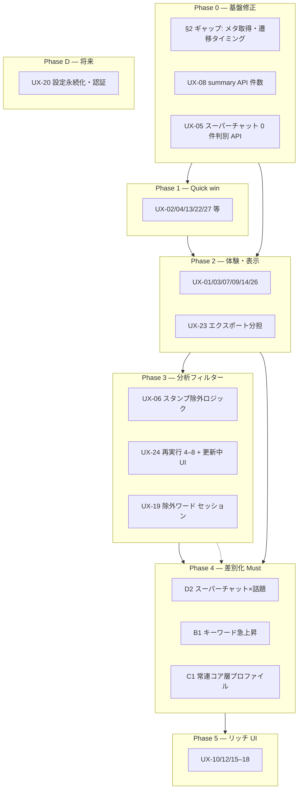

# LiveChatScope — UX 改修 実施計画

> **作成日**: 2026-06-21  
> **根拠**: [UX改修.md](UX改修.md)（方針 Q1–Q8 確定済み）+ コードベース照合（`dev` ブランチ）  
> **目的**: 各改修項目の **実現可能性**・**改修内容**・**依存関係**・**実施順序** を一本化し、並行作業可能な単位に分解する

---

## 0. 計画の前提

| 項目 | 内容 |
|------|------|
| **製品方針** | 分析・調査ツールとして **正確性最優先**（画面・エクスポート間の一貫性） |
| **性能目標** | 2k 規模は現状 PASS。72k 規模は **未検証** — 大規模配信向け改修では Stage 4（形態素解析）がボトルネックになりうる |
| **実装ルール** | [UX改修.md §0](UX改修.md) — 明示指示までコード改修しない（本書は **計画のみ**） |
| **工規模** | **小** = 1 ファイル中心・半日〜1 日 / **中** = 複数ファイル・API 追加 / **大** = 新パイプライン・横断変更 |
| **完了済** | UX-21 エクスポートファイル名 |

---

## 1. 全体フェーズ（推奨順序）



| Phase | 目的 | 主な ID | 並行可否 |
|:-----:|------|---------|:--------:|
| **0** | データ正確性・API 不整合の解消 | §2, UX-05, UX-08 | 3 レーン並行可 |
| **1** | 低リスク・即効 UI | UX-02, 04, 13, 22, 27 | フロント中心・全並行可 |
| **2** | 進捗・サマリー・エクスポート | UX-01, 03, 07, 09, 14, 23, 26 | 2 レーン（FE / BE） |
| **3** | グローバルフィルター基盤 | UX-06, 19, 24 | **直列**: 06 → 24 |
| **4** | 配信者・マネージャー差別化 | UX-25 **D2, B1, C1**, UX-11 | D2 と B1 部分並行可 |
| **5** | サムネ・プロフィール等 | UX-10, 12, 15–18 | コンポーネント共通化後に並行 |
| **D** | アカウント・永続設定 | UX-20 | 認証基盤後 |

---

## 2. 並行作業レーン（サブエージェント / 担当分割用）

| レーン | 担当範囲 | 主ファイル | Phase |
|--------|----------|------------|:-----:|
| **A: フロント Quick** | UX-02, 04, 13, 22, 27 | `export-menu.tsx`, `topics-tab.tsx`, `site-header.tsx`, `analyze/…/page.tsx` | 1 |
| **B: バックエンド API 整合** | UX-05, 08, §2 summary | `analysis.py`, `videos.py`, `fetch_worker.py` | 0–2 |
| **C: エクスポート** | UX-23, markdown 統一 | `export.py`, `stage8.py`, `export-menu.tsx`, `revenue-tab.tsx` | 2 |
| **D: 分析パイプライン** | UX-06, 14, 24 | `stage4.py`〜`stage8.py`, `refilter_pipeline.py`（新規） | 3 |
| **E: 差別化機能** | D2, B1, C1 | `stage5.py`, 新 `stage4b`, `analysis.py`, 各タブ | 4 |
| **F: デザイン** | UX-26 | `public/logo.svg`, `site-header.tsx`, `layout.tsx` | 2 |

---

## 3. §2 基盤ギャップ（他 UX の前提）

| ID | 内容 | 実現可能性 | 工規模 | 改修プラン |
|----|------|:----------:|:------:|------------|
| **G-01** | 動画メタ未保存（タイトル・チャンネル・尺） | 高 | 中 | ✅ `video_metadata.py` — chat-downloader メタを `videos` に UPDATE |
| **G-02** | 進捗画面が取得完了で即結果へ（分析中 409） | 高 | 小 | `analyze/…/page.tsx`: 遷移条件を `analysis_status=complete`（または `partial` 以上）に変更。UX-01 と同時 |
| **G-03** | `/summary` が stage7 設定より LIMIT 5 固定 | 高 | 小 | `analysis.py`: `analysis_defaults.json` の `summary_*_n` を参照、または `stream_summary` を読む — **UX-08** |
| **G-04** | markdown-summary API と Stage 8 キャッシュ不一致 | 高 | 小 | `export.py` が `stage8._build_markdown_summary` を再利用 — **UX-23** と共通 |
| **G-05** | `partial` 状態が未使用 | 中 | 中 | 将来: 基本分析のみ `partial` — 第一弾では G-02 修正を優先 |

---

## 4. 項目別 実施計画（UX-01〜27）

凡例: **実現可能性** 高 / 中 / 低 — **工規模** 小 / 中 / 大

### A. 進捗・ナビゲーション

| ID | 実現可能性 | 工規模 | 改修プラン | 依存 |
|----|:----------:|:------:|------------|------|
| **UX-01** | 高 | 中 | 5 段階ステッパー UI。`/status` の `analysis_stage` / `analysis_stage_label` を表示。古い Pipeline 文言削除 | G-02 |
| **UX-02** | 高 | 小 | `取得済みチャットコメント` に文言変更のみ | なし |
| **UX-03** | 中 | 小〜中 | FE: ポーリング 1s + 件/秒表示。BE: `batch_size` 100 化（任意） | なし |
| **UX-27** | 高 | 小 | `SiteHeader` に `linkedVideoId`。進捗画面のみ ID 部分を YouTube リンク。タイトル行は非リンク（Q5） | なし |

### B. 取得・分析ロジック

| ID | 実現可能性 | 工規模 | 改修プラン | 依存 |
|----|:----------:|:------:|------------|------|
| **UX-05** | 高 | 小 | `messages` を判定し `super_chat_status` を API 返却（なし / 取得疑い / あり）。収益タブ Empty に理由表示 | スーパーチャットあり配信での検証データ |
| **UX-06** | 中 | 中 | `message_filter.py` 新規。Stage 4–5 で `text_message` + スタンプパターン除外。設定 JSON | UX-24 の前提 |
| **UX-24** | 中 | 大 | `POST …/analysis/refilter` + `run_refilter_pipeline`（段階 **4,5,6a,6b,7,8**、6c 省略）。フィルター JSON 保存。409 で更新中ゲート。FE: バナー・Switch 無効化 | UX-06, UX-19（NG ワード） |
| **UX-14** | 高 | 小〜中 | `stage6c.py`: 平均比に加え **パーセンタイル** 閾値。`min_sec` 180 等。6c は refilter 対象外（Q1） | なし |

### C. サマリー

| ID | 実現可能性 | 工規模 | 改修プラン | 依存 |
|----|:----------:|:------:|------------|------|
| **UX-07** | 中 | 中 | 構成 TL に **全 topic_blocks** を渡す（summary API 拡張 or `/topics` 併用）。空状態の切り分けメッセージ | G-01, G-03 |
| **UX-08** | 高 | 小 | `analysis.py` LIMIT を stage7 設定に合わせる（10 件等） | G-03 |
| **UX-09** | 中 | 小〜中 | `formatStreamPosition()` で % + 序盤/中盤/終盤。サマリー・盛り上がりタブ | G-01 |

### D. 話題

| ID | 実現可能性 | 工規模 | 改修プラン | 依存 |
|----|:----------:|:------:|------------|------|
| **UX-10** | 高（B-1）/ 低（B-2） | 中 / 大 | B-1: 動画共通サムネ + 時刻。`youtube-thumbnail.ts` | なし |
| **UX-11** | 低（単体）/ 中（連動） | 大 / 小 | 本体は UX-06。UI は「スタンプ除外ベース」注記 | UX-06 |

### E. 盛り上がり

| ID | 実現可能性 | 工規模 | 改修プラン | 依存 |
|----|:----------:|:------:|------------|------|
| **UX-12** | 低 | 大 | ハイライト ±N 秒の代表コメント API（新規集計 or `highlight_context` 表） | 新 API |
| **UX-13** | 高 | 小 | ツールチップでスコア算式（密度÷移動平均、1.0=平均並み） | なし（Tooltip UI 追加推奨） |

### F. コミュニティ

| ID | 実現可能性 | 工規模 | 改修プラン | 依存 |
|----|:----------:|:------:|------------|------|
| **UX-15** | 高 | 小〜中 | コミュニティ: `author_id` → YouTube チャンネルリンク。検索: `messages_api` に `author_id` 追加 | API 1 箇所 |
| **UX-16** | 低 | 大 | 投稿者ごと最多文言 + トークン Top3 — 新 API / Stage 拡張 | UX-17 と共通化可 |
| **UX-17** | 低 | 大 | ユーザードロワー + `GET /authors/{id}/profile` | C1 と統合推奨 |

### G. 検索

| ID | 実現可能性 | 工規模 | 改修プラン | 依存 |
|----|:----------:|:------:|------------|------|
| **UX-18** | 中 | 中〜大 | 共通 `MessageRow`（サムネ + 投稿者リンク + ジャンプ） | UX-10, UX-15 |

### H. 設定

| ID | 実現可能性 | 工規模 | 改修プラン | 依存 |
|----|:----------:|:------:|------------|------|
| **UX-19** | 中 | 中 | URL 入力画面 or サマリー付近で **セッション限定** NG ワード / 除外ユーザー。`analysis_params` にマージ | UX-24 |
| **UX-20** | 低 | 大 | 認証 + 設定 CRUD。POC 代用: localStorage | Phase D |

### I. エクスポート

| ID | 実現可能性 | 工規模 | 改修プラン | 依存 |
|----|:----------:|:------:|------------|------|
| **UX-21** | — | — | ✅ 完了 | — |
| **UX-22** | 高 | 小 | ExportMenu: 「DL」「コピー」。収益タブ文言との統一は任意 | なし |
| **UX-23** | 高（機能）/ 中（72k） | 中〜大 | **JSON** = 分析一式（messages, highlights, topics, keywords 等追加）。**CSV** = チャットログのみ。ExportMenu に役割説明。収益タブはスーパーチャット専用 CSV を分離 | UX-24（フィルター反映）、G-04 |

### J. ブランド

| ID | 実現可能性 | 工規模 | 改修プラン | 依存 |
|----|:----------:|:------:|------------|------|
| **UX-26** | 高 | 中 | 信頼感・製品感: `logo.svg`, favicon, ヘッダ typography。デザイン asset 作成が主作業 | なし |

---

## 5. UX-25 差別化 Must（D2 / B1 / C1）

| ID | 名称 | 実現可能性 | 工規模 | 改修プラン | 主な変更 |
|----|------|:----------:|:------:|------------|----------|
| **D2** | スーパーチャット×話題ブロック | 高 | 小〜中 | Stage 5 で件数・通貨を正確化。`/topics` の count バグ修正。収益・サマリーに「どの話題でスーパーチャットが集中したか」表示 | `stage5.py`, `analysis.py`, `revenue-tab.tsx`, `summary-tab.tsx` |
| **B1** | キーワード急上昇 | 高 | 中 | Stage 4 拡張: `keyword_timeline` から burst スコア算出。`GET /keywords/bursts`。話題・サマリーに時系列リスト | 新 `stage4b` or stage4 内、 `topics-tab.tsx` |
| **C1** | 常連コア層プロファイル | 高 | 中〜大 | `GET /authors/{id}/profile`（ブロック参加率、初回/最終発言、スーパーチャット等）。コミュニティタブでドロワー | `community-tab.tsx`, 新 API。UX-17 と統合 |

**Must 実施順（推奨）**: **D2 → B1 → C1**（D2 は既存 DB のみで可。B1 は新アルゴリズム。C1 は UI ボリューム大）

**Nice（後続）**: D1, B3, E3 — チャプター export（E1/E2）は **Later**（Q3）

---

## 6. UX-24 詳細実装プラン（確定方針反映）

| 項目 | 内容 |
|------|------|
| **トリガー** | サマリー付近 Switch: NG キーワード除外 / スタンプのみ発言除外 |
| **再実行範囲（Q8）** | 段階 4, 5, 6a, 6b, 7, 8。**6c 省略** |
| **対象外（Q1）** | 密度・盛り上がり・Top 投稿者件数・低活動区間 |
| **Backend** | ① `display_filter_json` 保存 ② `run_refilter_pipeline()` ③ `POST /videos/{id}/analysis/refilter` ④ 実行中 `analysis_status=running` → 分析 API は 409 ⑤ 完了で `complete` |
| **Frontend** | ① `FilterContext`（video-dashboard） ② 更新中バナー ③ 影響タブローディング ④ 完了までフィルター反映エクスポート不可 ⑤ `/status` ポーリング |
| **性能リスク** | 72k で Stage 4 が数分〜十数分。Stage 4 の **バッチ INSERT 最適化** を Phase 3 前後で検討 |
| **正確性** | 狭い再実行（4–5 のみ）は **採用しない** |

---

## 7. リスク一覧

| リスク | 影響 | 緩和策 |
|--------|------|--------|
| Stage 4 性能（72k） | refilter / 初回分析が長時間 | `executemany`、tokens 省略、Janome 対象行削減（UX-06） |
| JSON export サイズ（72k） | タイムアウト・メモリ | ストリーミング DL、`include_messages` オプション、indent なし |
| スタンプ判定精度 | 話題ラベル品質 | チャンネル別辞書、UX-19 NG ワード、UX-24 フィルター |
| スーパーチャット取得判別 | 誤った Empty 表示 | UX-05: `messages` 生データで status 判定 |
| フィルター中 API 409 | 全タブ一時不可 | 更新中 UI で明示。密度・盛り上がりは **キャッシュ表示継続**（再計算しないため） |

---

## 8. フェーズ別 完了条件

### Phase 0
- [x] 取得後に `title` / `duration_seconds` が DB に入る（G-01）
- [ ] 進捗画面は分析完了後に結果へ（G-02）
- [ ] サマリー API がキーワード 10 件等、設定どおり（UX-08 / G-03）
- [x] スーパーチャット 0 件時に理由コードが API / UI に出る（UX-05）

### Phase 1
- [ ] UX-02, 04, 13, 22, 27 完了

### Phase 2
- [ ] 構成 TL が全ブロックまたは同等（UX-07）
- [ ] 盛り上がりに配信内位置（UX-09、尺あり時）
- [ ] JSON/CSV 役割分担 + ExportMenu 説明（UX-23 コア）
- [ ] ロゴ・ヘッダ（UX-26）

### Phase 3
- [ ] スタンプ除外ロジック（UX-06）
- [ ] グローバルフィルター + 広い再実行 + 更新中 UI（UX-24）
- [ ] セッション NG ワード（UX-19 最小）

### Phase 4
- [ ] D2, B1, C1 画面 + エクスポート反映
- [ ] 低活動パーセンタイル（UX-14）— Phase 2 から移動可

### Phase 5
- [ ] UX-10, 15, 18（共通コンポーネント）
- [ ] UX-12, 16, 17（余力）

---

## 9. 推奨マイルストーン（技術区切り）

| マイルストーン | 含む成果 | 並行例 |
|----------------|----------|--------|
| **M0: 信頼できるデータ** | Phase 0 完了 | レーン B のみ |
| **M1: 触ってよくなった** | Phase 0 + 1 | レーン A + B |
| **M2: 配信者が読める** | + Phase 2 + UX-23 | レーン C + F |
| **M3: フィルター付き分析** | + Phase 3 | レーン D 直列 |
| **M4: 差別化 Must** | + Phase 4 | レーン E（D2‖B1 開始可） |
| **M5: リッチ** | + Phase 5 | レーン F 再利用 |

---

## 10. 関連ドキュメント

| ドキュメント | 用途 |
|--------------|------|
| [工程進捗.md](工程進捗.md) | **全体進捗・完了整理・次工程** |
| [UX改修.md](UX改修.md) | 要望・方針・FAQ |
| [第一弾チェックリスト.md](第一弾チェックリスト.md) | 第一弾完了基準 |
| [分析パラメータ.md](分析パラメータ.md) | Stage 設定 |
| [API仕様.md](API仕様.md) | API 契約（改修時に更新） |

---

## 11. 項目別詳細（実現可能性・受け入れ条件・タスク分解）

> サブエージェントによる Backend / Frontend コード調査（2026-06-21）を統合。  
> **実現可能性**: 高 = 既存基盤でほぼ実装可能 / 中 = 設計判断・性能リスクあり / 低 = 新機能・大規模依存

### Phase 0 — 基盤（§2 ギャップ）

#### G-01 動画メタ保存

| 観点 | 内容 |
|------|------|
| **実現可能性** | 高 |
| **現状** | `fetch_worker.py` は messages のみ INSERT。`videos.title` / `channel_name` / `duration_seconds` は常に null になりうる |
| **タスク** | ① chat-downloader の video メタを取得 ② `videos` UPDATE ③ `GET /videos/{id}` で返却確認 |
| **受け入れ条件** | 取得完了後、結果画面ヘッダに YouTube タイトル・尺が表示される（null フォールバックは残してよい） |
| **効く UX** | UX-07, UX-09, UX-26 |

#### G-02 進捗→結果の遷移タイミング

| 観点 | 内容 |
|------|------|
| **実現可能性** | 高 |
| **現状** | `analyze/[videoId]/page.tsx` L33–35: `fetch_status=fetched` で即 `/videos/` へ。分析 `running` 中に 409 |
| **タスク** | 遷移条件を `analysis_status ∈ {complete, partial}` に変更。`fetched` かつ分析中は進捗画面に留まる |
| **受け入れ条件** | 結果画面初回ロードで summary API が 409 にならない |
| **効く UX** | UX-01 と同時対応 |

#### G-03 / UX-08 summary API 件数

| 観点 | 内容 |
|------|------|
| **実現可能性** | 高 |
| **現状** | `analysis.py` が highlights / keywords / topic preview すべて `LIMIT 5` 固定。Stage 7 は `summary_keywords_n=10` 等で正しく書込み。**`stream_summary` テーブルは API から未参照** |
| **タスク** | ① `load_analysis_defaults()["stage7"]` から LIMIT 取得（推奨）または ② `analysis_status=complete` 時は `stream_summary.summary_json` を返却 |
| **受け入れ条件** | サマリータブに Top キーワード **10 件**（設定値どおり） |
| **触るファイル** | `backend/app/api/analysis.py`, `frontend/components/tabs/summary-tab.tsx`（自動反映） |

#### G-04 markdown-summary 不一致

| 観点 | 内容 |
|------|------|
| **実現可能性** | 高 |
| **現状** | `export.py` の markdown-summary は peak + SC のみ。`stage8.py` は keywords + topics 含む |
| **タスク** | `export.py` が `stage8._build_markdown_summary` を再利用 |
| **受け入れ条件** | DL 版 markdown-summary と Stage 8 キャッシュの内容が一致 |
| **効く UX** | UX-23 |

---

### Phase 1 — Quick win（フロント中心・全並行可）

| ID | 実現可能性 | 工規模 | 主な変更 | 受け入れ条件 |
|----|:----------:|:------:|----------|--------------|
| **UX-02** | 高 | 小 | `analyze/…/page.tsx` L88–89 文言 | 「取得済みチャットコメント」と表示 |
| **UX-04** | 高 | 小 | `topics-tab.tsx` L65, `topic-timeline-bar.tsx` L64 | 「UC」表記が画面に残らない |
| **UX-13** | 高 | 小 | `summary-tab.tsx`, `highlights-tab.tsx` + Tooltip | スコア横に算式・目安が確認できる |
| **UX-22** | 高 | 小 | `export-menu.tsx` `actionLabel()` | メニュー行が短文化（DL / コピー） |
| **UX-27** | 高 | 小 | `site-header.tsx` + `linkedVideoId` prop | **進捗画面のみ** 動画 ID が YouTube へリンク。タイトル行は非リンク |

**並行レーン A**: 5 項目は相互依存なし。1 PR にまとめても可。

---

### Phase 2 — 体験・表示・エクスポート

#### UX-01 進捗ステップ詳細化

| 観点 | 内容 |
|------|------|
| **実現可能性** | 高 |
| **工規模** | 中 |
| **現状** | `analysis_stage` / `analysis_stage_label` は API 返却済みだが FE 未使用。古い Pipeline 文言あり |
| **Backend** | 変更不要（`pipeline.py` `STAGE_LABELS` 既存） |
| **Frontend タスク** | ① 5 段階ステッパー UI ② `fetch_status` + `analysis_stage` で active 決定 ③ outdated 文言削除 |
| **依存** | **G-02 必須** |
| **受け入れ条件** | 取得〜分析完了まで段階が視覚化され、完了後に結果へ遷移 |

#### UX-03 取得件数更新頻度

| 観点 | 内容 |
|------|------|
| **実現可能性** | 中（BE バッチ変更は任意） |
| **工規模** | 小〜中 |
| **タスク** | FE: ポーリング 1s + 件/秒表示。BE 任意: `batch_size` 100 |
| **受け入れ条件** | 取得中に件数が滑らかに増え、おおよその取得速度が分かる |

#### UX-07 構成タイムライン

| 観点 | 内容 |
|------|------|
| **実現可能性** | 中 |
| **工規模** | 中 |
| **現状** | サマリーは preview **5 件**のみ。話題タブは `/topics` で全件 |
| **タスク** | ① summary API 拡張 or サマリータブで `/topics` 併用 ② 空状態を 4 パターンに切り分け ③ `duration_seconds` 利用 |
| **依存** | G-01, G-03 |
| **受け入れ条件** | 分析完了後、構成 TL が配信全体を概ね反映（preview 5 件打ち切りでない） |

#### UX-09 盛り上がり配信内位置

| 観点 | 内容 |
|------|------|
| **実現可能性** | 中（尺 null 時は劣化表示） |
| **工規模** | 小〜中 |
| **タスク** | `lib/format.ts` に `formatStreamPosition()`。`HighlightsTab` に `durationSeconds` 渡す |
| **依存** | G-01 |
| **受け入れ条件** | 尺あり時、% + 序盤/中盤/終盤ラベル表示 |

#### UX-05 スーパーチャット 0 件判別

| 観点 | 内容 |
|------|------|
| **実現可能性** | 高 |
| **工規模** | 小 |
| **Backend タスク** | `_compute_super_chat_status()`: ① SC 系 type なし → `none_in_chat` ② type あり amount 全 null → `amount_parse_failed` ③ events あり → `present`。`/super-chats/summary` に返却 |
| **Frontend タスク** | `revenue-tab.tsx` EmptyState を status 別メッセージに |
| **残未決** | chat-downloader フィールド差異 — **SC あり配信での E2E 検証が必要** |
| **受け入れ条件** | 0 件時に「チャット上になかった」vs「取得・解析の問題」が区別できる |

#### UX-23 JSON/CSV 役割分担

| 観点 | 内容 |
|------|------|
| **実現可能性** | 高（機能）/ 中（72k 性能） |
| **工規模** | 中〜大 |
| **Backend タスク** | ① JSON に messages, highlights, topics, keywords, low_activity 追加 + `export_version: 2` ② G-04 markdown 統一 ③ 収益タブ用 SC 専用 CSV エンドポイント or クライアント側 SC CSV をラベル明示 |
| **Frontend タスク** | ExportMenu に `JSON — 分析結果一式` / `CSV — チャットログのみ` + ツールチップ |
| **残未決** | 説明 UI の置き場所（ExportMenu のみ vs 収益タブ vs 初回ツアー）— **ExportMenu + ツールチップを第一候補** |
| **依存** | UX-24 完了後にフィルター反映版 export |
| **受け入れ条件** | JSON に分析一式、CSV は messages のみ。ユーザーが役割の違いを UI 上で理解できる |

#### UX-26 ヘッダ・ロゴ

| 観点 | 内容 |
|------|------|
| **実現可能性** | 高 |
| **工規模** | 中（デザイン作業が主） |
| **タスク** | `logo.svg`, favicon, `site-header.tsx` typography, `layout.tsx` metadata |
| **受け入れ条件** | 信頼感・製品感（SaaS ツール寄り）のビジュアル |

**Phase 2 並行**: レーン B（UX-05, 08）‖ レーン C（UX-23）‖ レーン F（UX-26）‖ FE（UX-01, 03, 07, 09）

---

### Phase 3 — 分析フィルター（直列: UX-06 → UX-24 → UX-19）

#### UX-06 スタンプとテキスト分析分離

| 観点 | 内容 |
|------|------|
| **実現可能性** | 中 |
| **工規模** | 中 |
| **Backend タスク** | 新規 `message_filter.py`。Stage 4–5 のみ `text_message` + スタンプパターン除外。Stage 1–2 / 6c は全件のまま（Q1） |
| **Frontend** | 単独 UI なし（UX-24 に統合）。UX-11 注記更新 |
| **リスク** | スタンプ判定の過不足 → チャンネル別辞書、UX-19 NG ワードで補完 |
| **受け入れ条件** | 話題ラベル・Top キーワードからチャンネルスタンプ語の独占が減る |

#### UX-24 グローバル表示フィルター

| 観点 | 内容 |
|------|------|
| **実現可能性** | 中 |
| **工規模** | 大 |
| **Backend タスク** | ① `videos.display_filter_json` 列 ② `refilter_pipeline.py`（段階 4,5,6a,6b,7,8 / 6c 省略）③ `POST /videos/{id}/analysis/refilter` ④ `analysis_status=running` + 409 ゲート ⑤ Stage 4 `executemany` 最適化 |
| **Frontend タスク** | ① `GlobalFilterBar`（`video-dashboard.tsx` badges 行と Tabs の間）② Switch: NG キーワード / スタンプのみ除外 ③ 更新中バナー + Switch 無効化 ④ 影響タブ refetch ⑤ 密度・盛り上がりは **キャッシュ表示継続** ⑥ shadcn `Switch` 追加 |
| **性能** | 72k で Stage 4 が数分〜十数分 — refilter 前に INSERT 最適化推奨 |
| **受け入れ条件** | フィルター変更 → 再計算 → 話題・キーワード・エクスポートが一致。更新中 UI が明示される |

#### UX-19 除外ワード・除外ユーザー（セッション）

| 観点 | 内容 |
|------|------|
| **実現可能性** | 中 |
| **工規模** | 中 |
| **タスク** | ダッシュボード付近にセッション限定 NG ワード / 除外ユーザー UI → `display_filter_json` にマージ → UX-24 refilter トリガー |
| **依存** | UX-24 |
| **受け入れ条件** | セッション中に追加した NG ワードが話題・キーワードに反映される |

#### UX-14 低活動区間（相対判定）

| 観点 | 内容 |
|------|------|
| **実現可能性** | 高 |
| **工規模** | 小〜中 |
| **Backend タスク** | `stage6c.py`: パーセンタイル閾値モード追加、`min_sec` 180。config 更新 |
| **注意** | refilter 対象外（Q1）。既存動画は **フル再分析** でのみ反映 |
| **受け入れ条件** | 高密度配信でも相対的低活動区間が検出されうる |

---

### Phase 4 — 差別化 Must（UX-25）

#### D2 スーパーチャット × 話題ブロック

| 観点 | 内容 |
|------|------|
| **実現可能性** | 高 |
| **工規模** | 小〜中 |
| **既知バグ** | `analysis.py` L296: `/topics` の `super_chat_total[].count` が **常に 1** にハードコード |
| **Backend タスク** | ① count バグ修正 ② 多通貨 SC 対応（現状 JPY のみ集計）③ 任意: `GET /super-chats/by-topic` |
| **Frontend タスク** | 収益・サマリーに「どの話題で SC が集中したか」可視化（`topics-tab.tsx` は既に block 単位 SC 表示あり） |
| **受け入れ条件** | 話題ブロックごとの SC 件数・金額が正確。サマリー/収益から文脈が読める |

#### B1 キーワード急上昇

| 観点 | 内容 |
|------|------|
| **実現可能性** | 高 |
| **工規模** | 中 |
| **現状** | `keyword_timeline` は Stage 4 で生成済み。FE は timeline 未利用 |
| **Backend タスク** | burst スコア算出 → `keyword_bursts` 表 + `GET /keywords/bursts`。config: `burst_min_peak_count` 等 |
| **Frontend タスク** | 話題/サマリーに「急上昇キーワード」リスト + 時刻ジャンプ |
| **依存** | UX-06 で品質向上。UX-24 refilter で再計算 |
| **受け入れ条件** | 配信後に「いつ何が急上昇したか」が一覧できる |

#### C1 常連コア層プロファイル

| 観点 | 内容 |
|------|------|
| **実現可能性** | 高 |
| **工規模** | 中〜大 |
| **現状** | `is_core_regular`（Stage 6b）+ badge 表示のみ。profile API なし |
| **Backend タスク** | `GET /authors/{id}/profile`: ブロック参加率、初回/最終発言、SC 合計、top_topics |
| **Frontend タスク** | shadcn `Sheet` 追加 → コミュニティタブで著者クリック → ドロワー。**UX-17 と統合** |
| **受け入れ条件** | コア常連の行動プロファイルが 1 クリックで確認できる |

**Phase 4 並行**: D2（BE 修正 + FE 可視化）‖ B1（BE burst + FE）を開始可 → C1（UX-17 統合）

---

### Phase 5 — リッチ UI

| ID | 実現可能性 | 工規模 | 概要 | 依存 |
|----|:----------:|:------:|------|------|
| **UX-10** | 高(B-1)/低(B-2) | 中/大 | 動画共通サムネ + 時刻（B-1）。`youtube-thumbnail.ts` 新規 | なし |
| **UX-11** | 低/中 | 大/小 | 本体 UX-06。UI は「テキストベース」注記 | UX-06 |
| **UX-12** | 低 | 大 | ハイライト ±N 秒代表コメント — **新 API 必要** | 新 API |
| **UX-15** | 高 | 小〜中 | `author_id` → YouTube リンク。`messages_api` に author_id 追加 | API 1 箇所 |
| **UX-16** | 低 | 大 | 投稿者特徴コメント — 新集計 API | UX-17/C1 |
| **UX-17** | 低 | 大 | ユーザードロワー — **C1 と統合推奨** | C1 API |
| **UX-18** | 中 | 中〜大 | 共通 `MessageRow` | UX-10, UX-15 |

**推奨順**: UX-15 → UX-10 → UX-18（共通化）→ UX-12, 16, 17（余力）

---

### Phase D — 将来

| ID | 実現可能性 | 工規模 | 概要 |
|----|:----------:|:------:|------|
| **UX-20** | 低 | 大 | 認証 + 設定 CRUD。POC: localStorage |

---

## 12. コードベース照合 — 既知バグ・技術的負債

| # | 箇所 | 内容 | 関連 UX |
|---|------|------|---------|
| B-01 | `analysis.py` L107–116 | summary API が stage7 設定より LIMIT 5 固定 | UX-08, G-03 |
| B-02 | `analysis.py` L296 | `/topics` SC count が常に 1 | UX-25 D2 |
| B-03 | `export.py` vs `stage8.py` | markdown-summary 内容不一致 | UX-23, G-04 |
| B-04 | `fetch_worker.py` | 動画メタ未 UPDATE | G-01, UX-07, UX-09 |
| B-05 | `analyze/…/page.tsx` L33–35 | fetch 完了即遷移 → 409 | G-02, UX-01 |
| B-06 | `export.py` JSON | messages / highlights / topics 未含有 | UX-23 |
| B-07 | `revenue-tab.tsx` | 全 messages CSV API 共用 | UX-23 |
| B-08 | refilter API | **未実装**（greenfield） | UX-24 |
| B-09 | Stage 4 | トークン逐次 INSERT — 72k でボトルネック | UX-24 性能 |
| B-10 | `stream_summary` | Stage 7 書込み済みだが summary API 未参照 | UX-08 |

---

## 13. サブエージェント並行調査 — 推奨 Backend 順序

```
UX-08 → UX-05 → UX-14 ─┬─ UX-23（コア）
                        │
UX-06 ──────────────────┴─ UX-24（大）
                              │
                    UX-25: D2 → B1 → C1
```

**Frontend Quick win バッチ**（レーン A）: UX-02, 04, 13, 22, 27 — 相互依存なし、1 PR 可

---

## 変更履歴

| 日付 | 内容 |
|------|------|
| 2026-06-21 | 初版 — UX-01〜27 + §2 + UX-25 Must の実施計画。サブエージェント 3 レーン調査を統合 |
| 2026-06-21 | §11 項目別詳細、§12 既知バグ、§13 BE 順序。Backend/Frontend サブエージェント調査結果を反映 |
