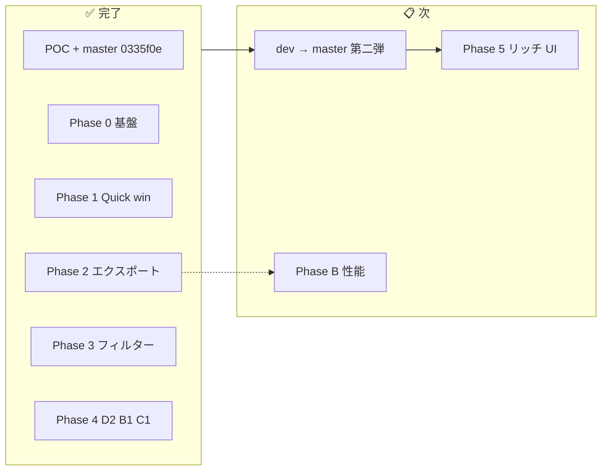

# LiveChatScope — 工程進捗

> **更新日**: 2026-06-21  
> **目的**: 全体進捗の単一入口。完了整理・未解消ギャップ・次工程をここに集約  
> **関連**: [引き継ぎ.md](引き継ぎ.md) / [UX実施計画.md](UX実施計画.md) / [UX改修.md](UX改修.md)

---

## 1. 全体サマリー

| 工程 | 状態 | 備考 |
|------|:----:|------|
| POC（第一弾） | ✅ | `master` @ `0335f0e` |
| UX Phase 0〜4 実装 | ✅ | `dev` @ `c094e25`（PR #6〜#16 統合済） |
| **dev → master 第二弾** | 📋 **次** | Phase 0〜4 をリリース |
| Phase 5 リッチ UI | 📋 | UX-07/09/17/26 等 |
| Phase B | 📋 | 50k+ 性能・中断再開 |

**現在地**: Phase 4 まで `dev` に統合完了。**第二弾リリース（`dev` → `master`）が次**。

---

## 2. UX 改修 — 実装済み（`dev` @ `c094e25`）

統合コミット: `c094e25` — Merge UX Phase 0-4 stack (#6-#16)

| PR | ID | 内容 | 状態 |
|:--:|-----|------|:----:|
| #6 | Phase 0/1 | G-02, UX-01/02/04/08/13/22/27 | ✅ Merged |
| #7 | G-01 | 動画メタ保存 + ヘッダ尺 | ✅ Merged |
| #8 | UX-05 | スパチャ 0 件理由 API + UI | ✅ Merged |
| #9 | G-04 | markdown-summary / Stage 8 統一 | ✅ Closed（`dev` 取込済） |
| #10 | UX-23 | JSON v2 + ExportMenu 説明 + 収益 SC CSV | ✅ Closed |
| #11 | UX-06/24 | message_filter + refilter + GlobalFilterBar | ✅ Closed |
| #12 | UX-19 | セッション NG / 除外ユーザー UI | ✅ Closed |
| #13 | D2 BE | SC × 話題正集計 | ✅ Closed |
| #14 | D2 FE | TopicSuperChatRanking | ✅ Closed |
| #15 | B1 | keyword_bursts API + KeywordBurstRanking | ✅ Closed |
| #16 | C1 | author profile API + AuthorProfileSheet | ✅ Closed |

`dev` のみ先行: **UX-21** エクスポートファイル名（`f6eaa6b`）

### フェーズ別完了内容

| Phase | 完了 ID | 要点 |
|:-----:|---------|------|
| **0** | G-01〜04, UX-05, UX-08 | メタ保存、409 解消、summary 件数、SC 判別、markdown 統一 |
| **1** | UX-01/02/04/13/22/27 | 進捗 5 段階、文言、スコア説明、ExportMenu 短文化 |
| **2** | UX-23 | JSON 分析一式 / CSV ログ分担 + 説明 UI |
| **3** | UX-06/19/24 | スタンプ除外、refilter API、GlobalFilterBar、セッション NG |
| **4** | **D2, B1, C1** | SC×話題正集計、キーワード急上昇、常連プロフィール Sheet |

---

## 3. 未解消ギャップ（Phase 5 以降）

| 優先 | 内容 | 対応 |
|:----:|------|------|
| 中 | 構成 TL が preview 5 件のみ（全ブロック未表示） | UX-07 |
| 中 | 盛り上がりに配信内位置（%）なし | UX-09 |
| 中 | ヘッダ・ロゴ未整備 | UX-26 |
| 低 | `partial` 分析状態が未使用 | G-05（将来） |
| — | 50k+ msg 性能未検証 | Phase B |

**解消済み**: `/topics` SC count 常に 1 バグ → **Phase 4 D2** で修正

詳細 backlog: [UX改修.md §3](UX改修.md)

---

## 4. Phase 4 完了内容（差別化 Must）

> 方針: [UX改修.md §5](UX改修.md) Must 暫定（配信者・マネージャー視点 Top 3）

### 4.1 D2 — スーパーチャット × 話題ブロック ✅

| 観点 | 内容 |
|------|------|
| **Backend** | `_super_chat_totals_for_range()` で話題ブロックごとの SC 件数・金額を正集計 |
| **Frontend** | `TopicSuperChatRanking` — 収益タブ・サマリーに話題別 SC 集中度 |
| **触ったファイル** | `analysis.py`, `topic-super-chat-ranking.tsx`, `topic-super-chat.ts` |
| **テスト** | `test_topics_super_chat.py` |

### 4.2 B1 — キーワード急上昇（バースト） ✅

| 観点 | 内容 |
|------|------|
| **Backend** | `stage4b.py` — burst 算出、`keyword_bursts` 表、`GET /keywords/bursts` |
| **Frontend** | `KeywordBurstRanking` — サマリーに急上昇キーワード + 時刻ジャンプ |
| **Config** | `burst_min_peak_count`, `burst_min_ratio` を `analysis_defaults.json` に追加 |
| **テスト** | `test_keyword_bursts.py` |

### 4.3 C1 — 常連コア層プロファイル ✅

| 観点 | 内容 |
|------|------|
| **Backend** | `author_profile.py` — `GET /authors/{author_id}/profile` |
| **Frontend** | `AuthorProfileSheet` — コミュニティタブで著者行クリック → Sheet |
| **テスト** | `test_author_profile.py` |

---

## 5. マイルストーン

| # | 名称 | 完了条件 | 状態 |
|:-:|------|----------|:----:|
| M3 | フィルター付き分析 | Phase 3 完了 | ✅ |
| **M4** | **差別化 Must** | D2 + B1 + C1 が画面・API で動作 | ✅ |
| M5 | 大規模配信 | Phase B: 50k+ P-01 PASS | 📋 |
| **M6** | **第二弾リリース** | `dev` → `master` マージ | 📋 **次** |

---

## 6. 次工程

### 6.1 第二弾リリース（優先）

`dev` @ `c094e25` を `master` にマージ。第一弾（`0335f0e`）から Phase 0〜4 の UX 改修・差別化機能を含む。

### 6.2 Phase 5 — リッチ UI

UX-07（構成 TL 全表示）、UX-09（盛り上がり位置 %）、UX-17（ユーザー別解析）、UX-26（ヘッダ整備）等 — [UX改修.md](UX改修.md)

### 6.3 Phase B — 性能

50k+ msg P-01、中断再開、chat-downloader 監視 — [テスト受入.md §6](テスト受入.md)

---

## 7. 第一弾・設計（参照）

POC 完了内容（W1〜W12, D-0〜D-6, E2E 2k）は [第一弾チェックリスト.md](第一弾チェックリスト.md) / [引き継ぎ.md §2–3](引き継ぎ.md) を参照。本書では重複記載を省略。

---

## 8. ドキュメント索引

| ファイル | 用途 |
|----------|------|
| **[工程進捗.md](工程進捗.md)** | **本書** — 進捗・次工程 |
| [UX実施計画.md](UX実施計画.md) | 項目別詳細・既知バグ B-01〜 |
| [UX改修.md](UX改修.md) | backlog 索引・方針 Q1–Q8 |
| [引き継ぎ.md](引き継ぎ.md) | 環境・PR・コード構成 |

---

## 変更履歴

| 日付 | 内容 |
|------|------|
| 2026-06-21 | Phase 4（D2/B1/C1）完了を反映。M4 達成。次工程を第二弾リリース + Phase 5/B に更新 |
| 2026-06-21 | Phase 0〜3 完了を反映。冗長セクション整理。Phase 4 作業予定を §4 に集約 |
| 2026-06-21 | 初版 |
