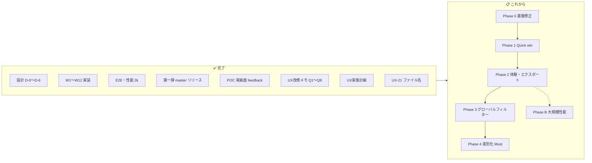

# LiveChatScope — 工程進捗

> **更新日**: 2026-06-21  
> **目的**: POC 完了〜改善案整理までの **全体進捗** を一本化し、完了タスクの整理と今後の作業計画の入口とする  
> **関連**: [第一弾チェックリスト.md](第一弾チェックリスト.md) / [引き継ぎ.md](引き継ぎ.md) / [UX実施計画.md](UX実施計画.md)

---

## 1. 全体サマリー

| 工程 | 状態 | 備考 |
|------|:----:|------|
| **POC（第一弾）** | ✅ 完了 | Phase A + A+。`master` @ `0335f0e` |
| **POC 改善案の整理** | ✅ 完了 | UX-01〜27 backlog + 方針 Q1〜Q8 + 実施計画 |
| **UX 改修の実装** | 🚧 着手 | Phase 0 完了（G-01〜04, UX-05, UX-08）、Phase 1 Quick win 完了 |
| **Phase B（本番品質）** | 📋 未着手 | 50k+ 性能・中断再開等 |

**現在地**: Phase 3 完了（UX-06/19/24）。**次は Phase 4 差別化 Must（D2 → B1 → C1）**。

---

## 2. 完了済みタスク（整理）

### 2.1 設計ドキュメント（D-0〜D-6）

| ID | 成果物 | ファイル |
|:--:|--------|----------|
| D-0 | 骨格（概要・要件・アーキテクチャ） | [概要.md](概要.md), [要件.md](要件.md), [アーキテクチャ.md](アーキテクチャ.md) |
| D-1 | 画面仕様 | [UI仕様.md](UI仕様.md) |
| D-2 | API 仕様 | [API仕様.md](API仕様.md) |
| D-3 | DB スキーマ | [DBスキーマ.md](DBスキーマ.md) |
| D-4 | 分析パラメータ | [分析パラメータ.md](分析パラメータ.md) |
| D-5 | 開発プロセス | [開発プロセス.md](開発プロセス.md) |
| D-6 | テスト受入基準 | [テスト受入.md](テスト受入.md) |

### 2.2 第一弾実装（W1〜W12）

| ID | 内容 | 状態 |
|:--:|------|:----:|
| W1 | Fetch Worker + messages 保存 | ✅ |
| W2 | Pipeline Stage 0–1, 3 | ✅ |
| W3 | Pipeline Stage 2, 4–8 | ✅ |
| W4 | REST API 全エンドポイント | ✅ |
| W5 | Next.js シェル・ルーティング | ✅ |
| W-F1 / W6 | サマリータブ + 共有 UI + mock | ✅ |
| W7 | 話題分析タブ | ✅ |
| W8 | 盛り上がりタブ | ✅ |
| W9 | 収益タブ | ✅ |
| W10 | コミュニティタブ | ✅ |
| W11 | 詳細検索タブ | ✅ |
| W12 | ExportMenu | ✅ |
| E2E | pytest スモーク + フルフロー | ✅ |

詳細: [引き継ぎ.md §3](引き継ぎ.md)

### 2.3 統合・リリース・品質

| 項目 | 結果 | 参照 |
|------|------|------|
| E2E フルフロー | ✅ PASS（`8ZaCtuVdWYc` ~1,960 msg） | [E2E手順.md](E2E手順.md) |
| 性能 P-02〜P-05 | ✅ PASS（2k 規模） | [引き継ぎ.md §6](引き継ぎ.md) |
| P-01 全パイプライン | ~15s（2k msg） | 同上 |
| 負タイムスタンプ修正 | ✅ | commit `e0ade6a` |
| chat-downloader | Indigo128 fork 固定 | [テスト受入.md §8](テスト受入.md) |
| **`dev` → `master` マージ** | ✅ `0335f0e` | [第一弾チェックリスト.md §B](第一弾チェックリスト.md) |

### 2.4 POC 改善案整理（ドキュメント）

| 項目 | 状態 | ファイル |
|------|:----:|----------|
| 実画面 feedback 取り込み | ✅ | [UX改修.md](UX改修.md) |
| コード照合・実装ギャップ整理 | ✅ | 同上 §2 |
| 方針決定 Q1〜Q8 | ✅ | 同上 §1 |
| 実現可能性・フェーズ・並行レーン | ✅ | [UX実施計画.md](UX実施計画.md) |
| エクスポート精査（JSON/CSV 分担等） | ✅ | UX改修メモ UX-23 |
| 差別化 Must 暫定（D2, B1, C1） | ✅ | UX改修メモ §5 |

### 2.5 UX 改修のうち実装済み

| ID | 内容 | commit / 備考 |
|:--:|------|---------------|
| **G-04** | markdown-summary API が stage8 ビルダーを再利用 | `cursor/ux-g04-markdown-unify-10cc` |
| **UX-23** | JSON v2 分析一式 + ExportMenu / 収益タブ CSV 分担 | `cursor/ux-23-json-csv-export-10cc` |
| **UX-06/24** | message_filter + refilter API + GlobalFilterBar | `cursor/ux-06-24-global-filter-10cc` |
| **UX-19** | セッション NG キーワード + 除外ユーザー ID UI | `cursor/ux-19-session-ng-words-10cc` |
| **UX-21** | エクスポートファイル名 `LiveChatScope_Result_{video_id}_*` | `f6eaa6b` |

---

## 3. 未完了・既知ギャップ（実装前に把握）

[UX改修メモ §2](UX改修.md) および [UX実施計画 §12](UX実施計画.md) より抜粋。

| 優先 | 内容 | 影響 |
|:----:|------|------|
| **高** | ~~動画メタ（タイトル・尺）未保存~~ → **G-01 完了** | UX-07, UX-09 |
| **高** | 進捗画面が fetch 完了で即遷移 → 分析中 409 | UX-01 |
| **高** | ~~summary API が LIMIT 5 固定~~ → **G-03/UX-08 完了** | — |
| **高** | ~~markdown-summary API / Stage 8 不一致~~ → **G-04 完了** | UX-23 |
| **中** | `/topics` の SC count が常に 1 | UX-25 D2 |
| **中** | ~~JSON export が分析一式未含有~~ → **UX-23 完了** | — |
| **大** | ~~グローバルフィルター・refilter API 未実装~~ → **UX-06/24 完了** | UX-19 |
| **—** | 50k+ msg 性能未検証 | Phase B |

---

## 4. これからの作業計画

詳細タスク分解: **[UX実施計画.md](UX実施計画.md)**

### 4.1 推奨フェーズ

| Phase | 目的 | 主な ID | 着手条件 |
|:-----:|------|---------|----------|
| **0** | データ正確性の基盤 | G-01 ✅ … UX-05 ✅ | **完了** |
| **3** | グローバルフィルター | UX-06 ✅, UX-24 ✅, UX-19 ✅ | **完了** |
| **1** | Quick win UI | UX-02, 04, 13, 22, 27 | Phase 0 と並行可（409 修正除く） |
| **2** | 体験・エクスポート | UX-01, 03, 07, 09, 14, 23, 26 | Phase 0 完了後 |
| **3** | グローバルフィルター | UX-06 → UX-24 → UX-19 | **直列** |
| **4** | 差別化 Must | D2 → B1 → C1 | Phase 2 以降。D2‖B1 部分並行可 |
| **5** | リッチ UI | UX-10, 12, 15〜18 | Phase 4 以降 |
| **B** | 本番品質 | 50k+ P-01, 中断再開 | Phase 0〜2 と並行検討可 |

### 4.2 マイルストーン

| # | 名称 | 完了条件 |
|:-:|------|----------|
| **M0** | 信頼できるデータ | Phase 0 完了（メタ・409・summary LIMIT・SC 判別） |
| **M1** | 触ってよくなった | + Phase 1 Quick win |
| **M2** | 配信者が読める | + Phase 2（構成 TL・JSON/CSV・ロゴ） |
| **M3** | フィルター付き分析 | + Phase 3（UX-24 広い再実行） |
| **M4** | 差別化 Must | + D2, B1, C1 |
| **M5** | 大規模配信対応 | Phase B: 50k+ 性能 PASS |

### 4.3 並行作業レーン（担当分割用）

| レーン | 担当 | Phase |
|--------|------|:-----:|
| A フロント Quick | UX-02, 04, 13, 22, 27 | 1 |
| B API 整合 | UX-05, 08, fetch メタ | 0–2 |
| C エクスポート | UX-23 | 2 |
| D パイプライン | UX-06, 14, 24 | 3 |
| E 差別化 | D2, B1, C1 | 4 |
| F デザイン | UX-26 | 2 |

### 4.4 直近の推奨着手順（実装フェーズ）

1. ~~**G-02** 進捗→結果の遷移修正~~ ✅
2. ~~**G-01** 動画メタ保存~~ ✅
3. ~~**UX-08 / G-03** summary API 件数整合~~ ✅
4. ~~**Phase 1 バッチ**（UX-02, 04, 13, 22, 27）~~ ✅
5. ~~**UX-05** スーパーチャット 0 件判別 API + UI~~ ✅
6. ~~**G-04** markdown-summary API / Stage 8 統一~~ ✅
7. ~~**UX-23** JSON 一式 + 説明 UI~~ ✅
8. ~~**UX-06 → UX-24** フィルター基盤~~ ✅
9. ~~**UX-19** セッション NG ワード~~ ✅
10. **D2 → B1 → C1** 差別化 Must

---

## 5. ドキュメント索引

| ファイル | 用途 |
|----------|------|
| **[工程進捗.md](工程進捗.md)** | **本書** — 全体進捗・完了整理・次工程 |
| [第一弾チェックリスト.md](第一弾チェックリスト.md) | 第一弾（POC）完了チェック |
| [引き継ぎ.md](引き継ぎ.md) | 環境構築・E2E 結果・別 PC 移行 |
| [UX改修.md](UX改修.md) | 改修 backlog・方針 Q1〜Q8 |
| [UX実施計画.md](UX実施計画.md) | 実現可能性・フェーズ・項目別プラン |
| [概要.md](概要.md) | プロダクト概要・フェーズ定義 |
| [開発プロセス.md](開発プロセス.md) | ブランチ・Task 運用 |

---

## 変更履歴

| 日付 | 内容 |
|------|------|
| 2026-06-21 | UX-19 完了 — セッション NG キーワード / 除外ユーザー UI |
| 2026-06-21 | G-04 完了 — markdown-summary export が stage8 ビルダーを再利用 |
| 2026-06-21 | 初版 — POC 完了・改善案整理完了を反映。docs ファイル名日本語化と同時作成 |
