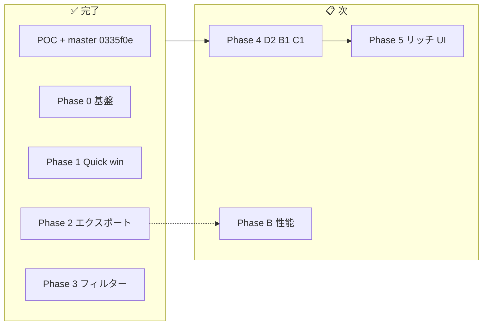
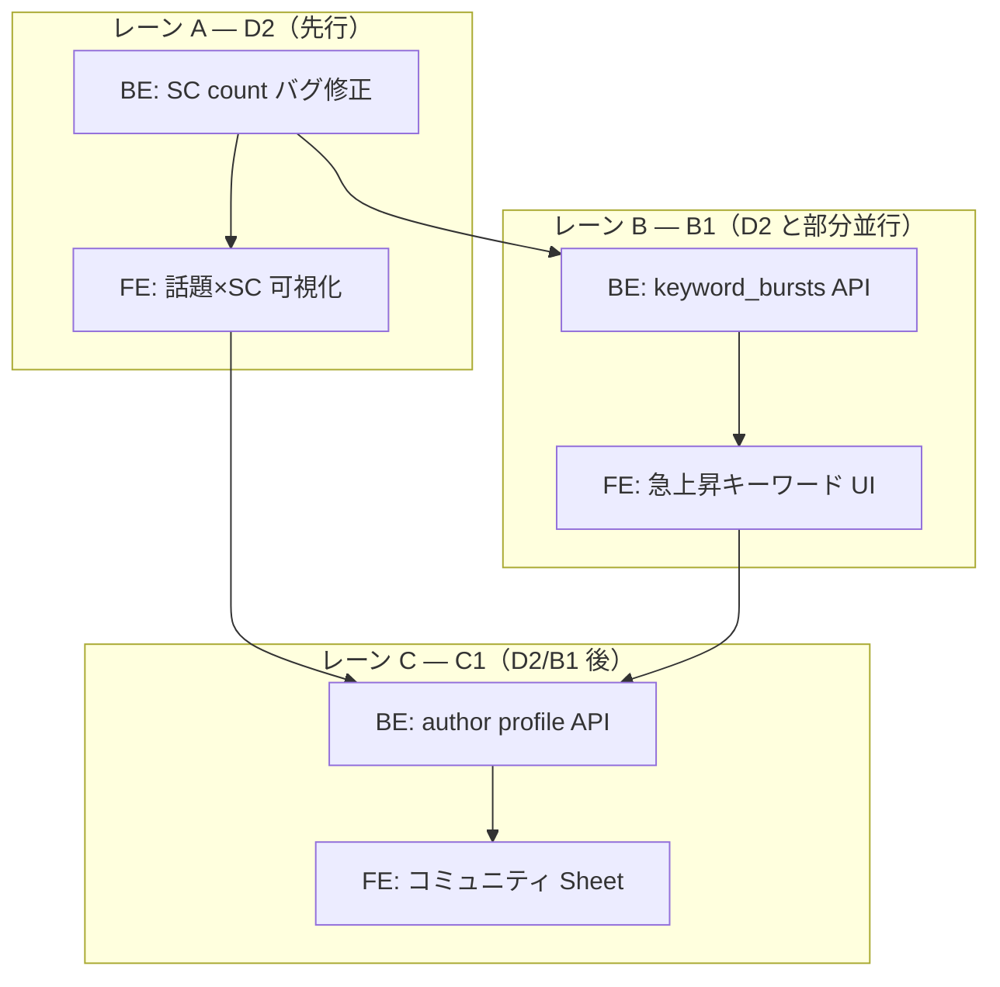

# LiveChatScope — 工程進捗

> **更新日**: 2026-06-21  
> **目的**: 全体進捗の単一入口。完了整理・未解消ギャップ・次工程（Phase 4）をここに集約  
> **関連**: [引き継ぎ.md](引き継ぎ.md) / [UX実施計画.md](UX実施計画.md) / [UX改修.md](UX改修.md)

---

## 1. 全体サマリー

| 工程 | 状態 | 備考 |
|------|:----:|------|
| POC（第一弾） | ✅ | `master` @ `0335f0e` |
| UX Phase 0〜3 実装 | ✅ | PR **#6〜#12**（`dev` 未マージ） |
| **Phase 4 差別化 Must** | 📋 **次** | D2 → B1 → C1 |
| Phase B | 📋 | 50k+ 性能・中断再開 |

**現在地**: Phase 3 まで実装完了。**PR マージ後 Phase 4 着手**。

---

## 2. UX 改修 — 実装済み（PR スタック）

マージ順: **#6 → #7 → #8 → #9 → #10 → #11 → #12**（各 PR は前 PR のブランチ上に積み上げ）

| PR | ID | 内容 | ブランチ |
|:--:|-----|------|----------|
| #6 | Phase 0/1 | G-02, UX-01/02/04/08/13/22/27 | `cursor/ux-phase0-phase1-10cc` |
| #7 | G-01 | 動画メタ保存 + ヘッダ尺 | `cursor/ux-g01-video-meta-10cc` |
| #8 | UX-05 | スパチャ 0 件理由 API + UI | `cursor/ux-g05-superchat-status-10cc` |
| #9 | G-04 | markdown-summary / Stage 8 統一 | `cursor/ux-g04-markdown-unify-10cc` |
| #10 | UX-23 | JSON v2 + ExportMenu 説明 + 収益 SC CSV | `cursor/ux-23-json-csv-export-10cc` |
| #11 | UX-06/24 | message_filter + refilter + GlobalFilterBar | `cursor/ux-06-24-global-filter-10cc` |
| #12 | UX-19 | セッション NG / 除外ユーザー UI | `cursor/ux-19-session-ng-words-10cc` |

`dev` のみ先行: **UX-21** エクスポートファイル名（`f6eaa6b`）

### フェーズ別完了内容

| Phase | 完了 ID | 要点 |
|:-----:|---------|------|
| **0** | G-01〜04, UX-05, UX-08 | メタ保存、409 解消、summary 件数、SC 判別、markdown 統一 |
| **1** | UX-01/02/04/13/22/27 | 進捗 5 段階、文言、スコア説明、ExportMenu 短文化 |
| **2** | UX-23 | JSON 分析一式 / CSV ログ分担 + 説明 UI |
| **3** | UX-06/19/24 | スタンプ除外、refilter API、GlobalFilterBar、セッション NG |

---

## 3. 未解消ギャップ（Phase 4 以降）

| 優先 | 内容 | 対応 |
|:----:|------|------|
| **高** | `/topics` の SC count が常に 1（既知バグ） | **Phase 4 D2** |
| 中 | 構成 TL が preview 5 件のみ（全ブロック未表示） | UX-07 |
| 中 | 盛り上がりに配信内位置（%）なし | UX-09 |
| 中 | ヘッダ・ロゴ未整備 | UX-26 |
| 低 | `partial` 分析状態が未使用 | G-05（将来） |
| — | 50k+ msg 性能未検証 | Phase B |

詳細 backlog: [UX改修.md §3](UX改修.md)

---

## 4. Phase 4 作業予定（差別化 Must）

> 方針: [UX改修.md §5](UX改修.md) Must 暫定（配信者・マネージャー視点 Top 3）  
> 詳細タスク: [UX実施計画.md § Phase 4](UX実施計画.md)

### 4.1 全体像

**推奨順**: **D2 → B1 → C1**（D2 の BE 修正完了後、B1 BE/FE を D2 FE と並行可）

---

### 4.2 D2 — スーパーチャット × 話題ブロック

**目的**: 「どの話題で SC が集中したか」を振り返り・収益判断に使えるようにする。

| 観点 | 内容 |
|------|------|
| **既知バグ** | `analysis.py` `/topics`: `super_chat_total[].count` が **常に 1** 固定 |
| **Backend** | ① count バグ修正 ② 話題ブロックごとの SC 件数・金額を `super_chat_events` から正集計 ③（任意）多通貨対応 |
| **Frontend** | 収益タブ・サマリーに「話題別 SC 集中度」を表示（`topics-tab.tsx` は block 単位 SC あり — 数値の正確性を優先） |
| **触るファイル** | `backend/app/api/analysis.py`, `frontend/components/tabs/revenue-tab.tsx`, `summary-tab.tsx`, `topics-tab.tsx` |
| **受け入れ** | 話題ブロックごとの SC 件数・金額が実データと一致。サマリー/収益から文脈が読める |
| **工規模** | 小〜中 |

**作業ステップ（案）**

1. `/topics` の SC count ハードコードを修正し、テスト追加
2. 話題ブロック API の SC 合計が `super_chat_events` と整合するか pytest で検証
3. サマリー or 収益タブに「SC が集中した話題 Top N」ウィジェット追加
4. （余力）多通貨 SC の topic 集計

---

### 4.3 B1 — キーワード急上昇（バースト）

**目的**: 配信後に「いつ・何のキーワードが急上昇したか」を一覧で把握する。

| 観点 | 内容 |
|------|------|
| **現状** | Stage 4 で `keyword_timeline` 生成済み。FE は未利用 |
| **Backend** | バケット間の増加率から burst スコア算出 → `keyword_bursts` テーブル（新規）+ `GET /keywords/bursts` |
| **Config** | `burst_min_peak_count`, `burst_min_ratio` 等を `analysis_defaults.json` に追加 |
| **Frontend** | サマリー or 話題タブに「急上昇キーワード」リスト + 時刻ジャンプ |
| **触るファイル** | 新規 `stage4b.py` or stage4 拡張, `analysis.py`, `summary-tab.tsx` / `topics-tab.tsx` |
| **依存** | UX-06/24 完了済（フィルター後の timeline で再計算可能） |
| **受け入れ** | 急上昇イベントが時刻付きで一覧表示され、YouTube ジャンプできる |
| **工規模** | 中 |

**作業ステップ（案）**

1. burst 算出ロジック設計（隣接バケット比 or 移動平均比）
2. Pipeline Stage 4 後 or 7 前に burst 書込み
3. API エンドポイント + テスト
4. FE リスト UI + jump_url 連携

---

### 4.4 C1 — 常連コア層プロファイル

**目的**: コミュニティ運営向けに、コア常連の行動を 1 クリックで把握する。

| 観点 | 内容 |
|------|------|
| **現状** | Stage 6b `is_core_regular` + badge のみ。詳細 API なし |
| **Backend** | `GET /authors/{author_id}/profile` — ブロック参加率、初回/最終発言、SC 合計、top_topics |
| **Frontend** | shadcn `Sheet` — コミュニティタブで著者行クリック → ドロワー（**UX-17 と統合**） |
| **触るファイル** | `analysis.py`, `community-tab.tsx`, 新規 `author-profile-sheet.tsx` |
| **受け入れ** | コア常連のプロファイルが 1 クリックで確認できる |
| **工規模** | 中〜大 |

**作業ステップ（案）**

1. profile レスポンススキーマ定義（API仕様.md 更新）
2. DB クエリ集約（既存 `author_stats`, `topic_author_stats`, `super_chat_events` から）
3. FE Sheet + コミュニティタブ連携
4. （余力）UX-17 ユーザー別解析ビューとの UI 統合

---

### 4.5 並行・PR 分割の目安

| レーン | 担当範囲 | PR 案 |
|--------|----------|-------|
| **A** | D2 Backend（バグ修正 + 集計） | `cursor/ux25-d2-sc-topics-be-10cc` |
| **A'** | D2 Frontend（可視化） | `cursor/ux25-d2-sc-topics-fe-10cc` |
| **B** | B1 Backend + API | `cursor/ux25-b1-keyword-burst-be-10cc` |
| **B'** | B1 Frontend | `cursor/ux25-b1-keyword-burst-fe-10cc` |
| **C** | C1 Backend + Frontend | `cursor/ux25-c1-author-profile-10cc` |

D2 BE マージ後に B1 を並行開始。C1 は D2/B1 の API 安定後が安全。

---

### 4.6 マイルストーン

| # | 名称 | 完了条件 |
|:-:|------|----------|
| M3 | フィルター付き分析 | ✅ Phase 3 完了（PR #11/#12） |
| **M4** | **差別化 Must** | D2 + B1 + C1 が画面・API で動作 |
| M5 | 大規模配信 | Phase B: 50k+ P-01 PASS |

---

## 5. 第一弾・設計（参照）

POC 完了内容（W1〜W12, D-0〜D-6, E2E 2k）は [第一弾チェックリスト.md](第一弾チェックリスト.md) / [引き継ぎ.md §2–3](引き継ぎ.md) を参照。本書では重複記載を省略。

---

## 6. ドキュメント索引

| ファイル | 用途 |
|----------|------|
| **[工程進捗.md](工程進捗.md)** | **本書** — 進捗・Phase 4 予定 |
| [UX実施計画.md](UX実施計画.md) | 項目別詳細・既知バグ B-01〜 |
| [UX改修.md](UX改修.md) | backlog 索引・方針 Q1–Q8 |
| [引き継ぎ.md](引き継ぎ.md) | 環境・PR・コード構成 |

---

## 変更履歴

| 日付 | 内容 |
|------|------|
| 2026-06-21 | Phase 0〜3 完了を反映。冗長セクション整理。Phase 4 作業予定を §4 に集約 |
| 2026-06-21 | 初版 |
